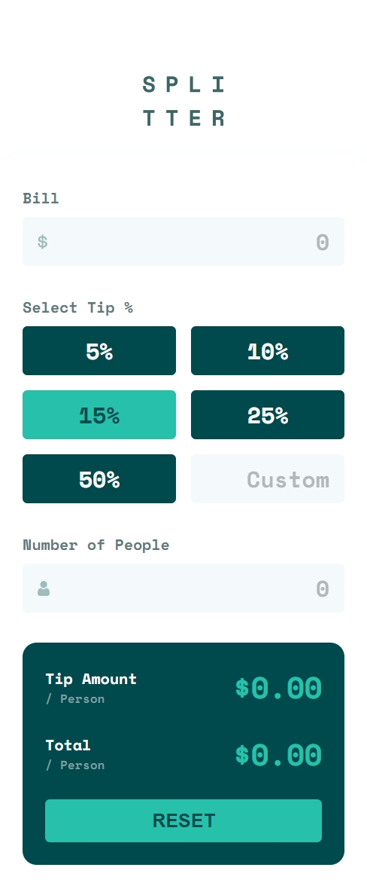

# Frontend Mentor - Tip calculator app solution

This is a solution to the [Tip calculator app challenge on Frontend Mentor](https://www.frontendmentor.io/challenges/tip-calculator-app-ugJNGbJUX). Frontend Mentor challenges help you improve your coding skills by building realistic projects.

## Table of contents

- [Overview](#overview)
  - [The challenge](#the-challenge)
  - [Screenshot](#screenshot)
  - [Links](#links)
- [My process](#my-process)
  - [Built with](#built-with)
  - [What I learned](#what-i-learned)
  - [Continued development](#continued-development)
  - [Useful resources](#useful-resources)
- [Author](#author)
- [Acknowledgments](#acknowledgments)

## Overview

### The challenge

Users should be able to:

- View the optimal layout for the app depending on their device's screen size
- See hover states for all interactive elements on the page
- Calculate the correct tip and total cost of the bill per person
- Reset the form using the reset button
- See accessible and semantic markup including usage of `<fieldset>`, `<legend>`, and `<output>` with `aria-live`

### Screenshot

### Links

- Solution URL: [Solution URL](https://www.frontendmentor.io/solutions/tip-calculator-app-gzo0smYz1x)
- Live Site URL: [Live Site](https://rishabhsikka3.github.io/tip-calculator/)

## My process

### Built with

- Semantic HTML5 markup
- Accessible forms using ARIA attributes
- CSS custom properties with SCSS (variables and functions)
- Sass mixins for grid and flex utilities
- Flexbox and CSS Grid layout
- Mobile-first responsive design
- JavaScript (vanilla) with modular structure
- Focus and error management using `aria-live` and validation states

### What I learned

This project reinforced several front-end best practices. A few highlights include:

- How to use `<output>` with `aria-live="polite"` to update screen reader output dynamically.
- The `fieldset` and `legend` elements improve semantic grouping of radio inputs.
- Styling custom radio inputs using the `:has()` selector and hiding the native `appearance`.
- Resetting forms and managing state purely with JavaScript, including conditional logic for inputs and custom tip values.

### Continued development

- I’d like to explore how to manage complex state transitions with accessibility in mind, possibly using a small framework.
- Improving keyboard-only navigation and active state visuals.
- Testing with screen readers to refine ARIA usage and feedback timing.

### Useful resources

- [MDN - aria-live](https://developer.mozilla.org/en-US/docs/Web/Accessibility/ARIA/Attributes/aria-live) - Helped understand how screen readers react to dynamic content.
- [A Guide to Accessible Form Validation](https://www.smashingmagazine.com/2023/02/guide-accessible-form-validation/#invalid-fields) - Great reference for form accessibility practices.

## Author

- Name – Rishabh Sikka
- Frontend Mentor – [@RishabhSikka3](https://www.frontendmentor.io/profile/RishabhSikka3)

## Acknowledgments

Thanks to Frontend Mentor for providing accessible design challenges. And a shoutout to the accessibility and frontend development communities for their thorough documentation and examples.
